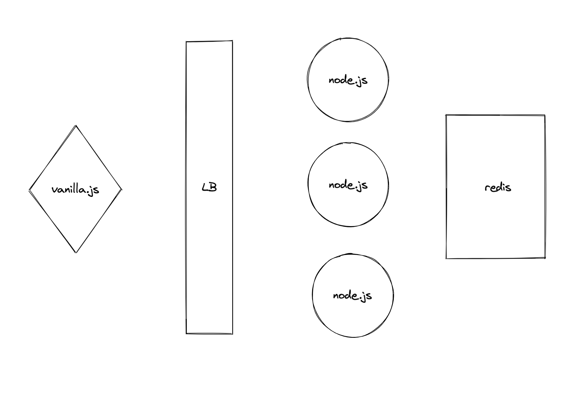

# bicoin.link

Bet on the 1 minute BitCoin price fluctuations.

Please visit [bicoin.link](https://bicoin.link) to try it live.

## Useful commands

- `cd prototype`
- `make` run locally in dev mode
- `make docker-hub` build and publish to docker hub
- `cd aws-stack && cdk deploy` deploy this stack to your default AWS account/region
- `cd aws-stack && cdk diff` compare deployed stack with current state
- `cd aws-stack && cdk synth` emits the synthesized CloudFormation template

# Architecture

# TODO

- render zoom
- render local times
- animate min/max price
- animate price
- implement disallow overlaping bets
- impleent pub/sub for cross server broadcast
- implement scores
- implement deletion of old bets (or just keep the last 11)
- implement db transactions / redis MULTI command
- implement server side check for unresolved bets to prevent betting in parrallel
- sound/speach
- write tests
- record a screen recording and speed it up as gif
- google/github auth
- job queue to resolve bets

# DONE

- render responsivly / mobile friendly
- render price history
- https redirect
- retina support / devicePixelRatio / DPI
- deploy using CDK to AWS
- animated favicon
- render times label
- render price labels
- render open and close/current time of the bet in the bet list
- implement bets resolving after timeout of 1 minute = 60 seconds

# WISH LIST

- render bets as lines
- multiple tickers
- pack price history in binary array and send it down compressed to speed up boot time
- React clienet
- Svelte client
- Flutter client
- Convert to TypeScript
